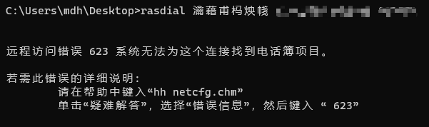
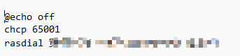
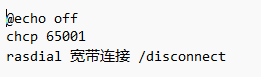
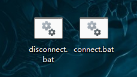
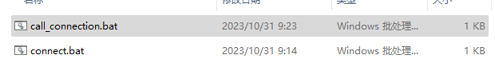
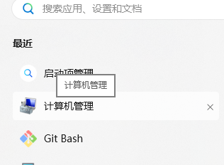

# 设置自动拨号脚本遇到的问题

## 问题阐述：

每次打开电脑都要手动拨号连接实在太麻烦了，懒是第一生产力，于是我就开始找方法，下面是我中途遇到的问题与解决方法。


## 1. 需要用到的命令行

- 连接网络

```bash
rasdial 宽带连接 username passwd
```

- 断开网络

```bash
rasdial connect_name /disconnect
```


## 2.bat文件运行一闪而过的，运行失败

在cmd窗口能够正常运行，打包为bat文件时。bat文件运行一闪而过的问题

于是在bat文件最后一行加上了pause观察发现。出现了乱码



这里是由于，出现了乱码导致访问失败。

## 3.解决乱码问题

这里先引入概念：

> chcp936与chcp65001有什么区别？
>
> 
>
> `chcp` 是 Windows 命令行中的命令，用于改变当前控制台的代码页（code page），即字符编码。不同的代码页支持不同的字符集，因此选择适当的代码页可以确保在命令行中正确显示文本。
>
> - `chcp 936`：这个命令将控制台的代码页设置为936，也被称为GB2312或GBK编码，是用于简体中文的字符编码。当您将代码页设置为936时，控制台会使用这个编码来解释和显示文本，确保中文字符正确显示。
> - `chcp 65001`：这个命令将控制台的代码页设置为65001，也被称为UTF-8编码。UTF-8是一种用于表示Unicode字符的多字节字符编码，支持几乎所有的语言和符号。将代码页设置为65001可以确保控制台能够正确处理和显示各种语言的文本，包括中文、日文、韩文等等。
>
> 区别在于，`chcp 936` 使用GBK编码，适用于简体中文，而 `chcp 65001` 使用UTF-8编码，是一种通用的Unicode字符编码，支持多种语言。选择使用哪个代码页取决于您希望在命令行中处理哪些语言的文本。如果需要处理多种语言的文本，通常建议使用 `chcp 65001` 来确保兼容性。

```bash
chcp #查看当前代码页
chcp 65001 #将控制台的代码页设置为65001
```

我用chcp查看代码页发现是936，兼容不了我的文字。所以切换为65001代码页。再加上@echo off，让cmd窗口不显示。最中的bat为：

- 连接



- 断开连接

 

`双击下面的图标即可成功运行`



## 4.bat最小化运行并且关闭

用另一个文件调用然后最小化



exit关闭cmd窗口


## 5.设置触发器

参考下面这篇文章设置触发器

https://github.com/yuanzhouxue/auto-pppoe

设置好后，就能完成开机自动连接了😊

进入计算机管理来设置


